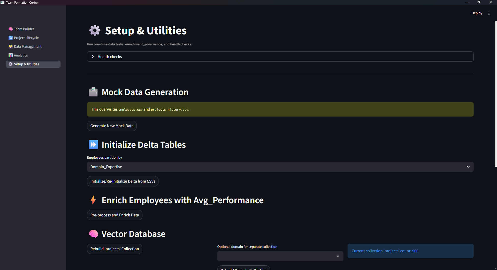
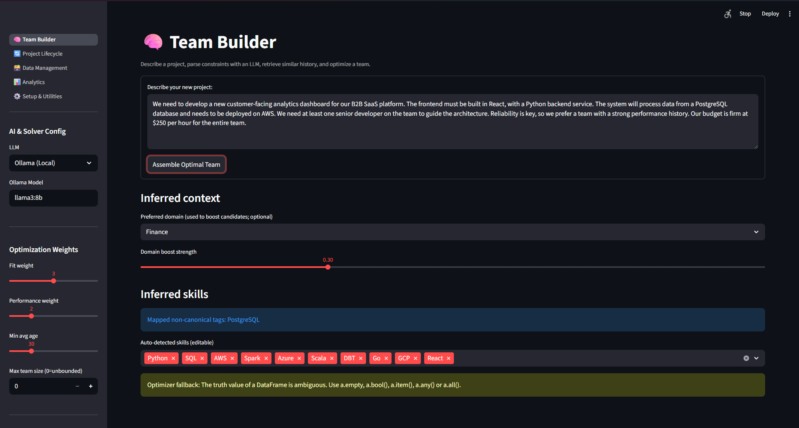
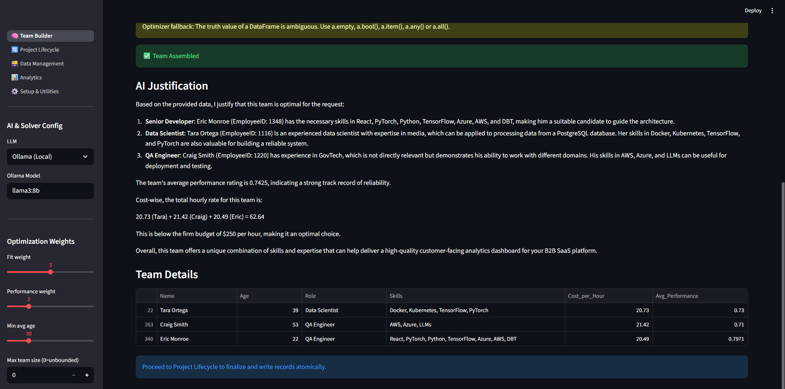
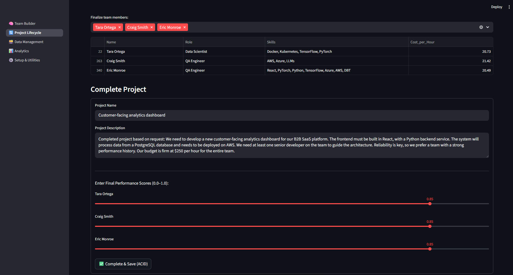
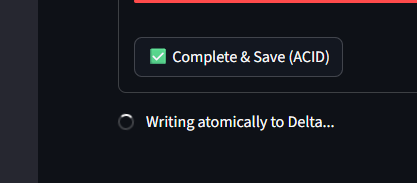
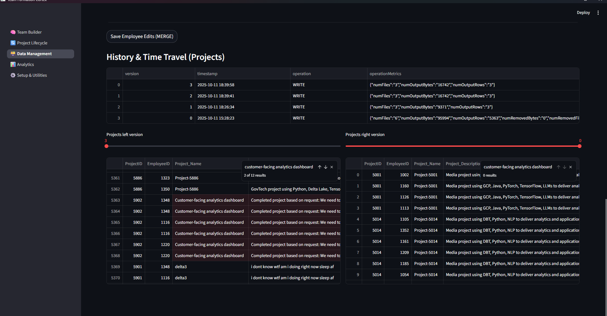
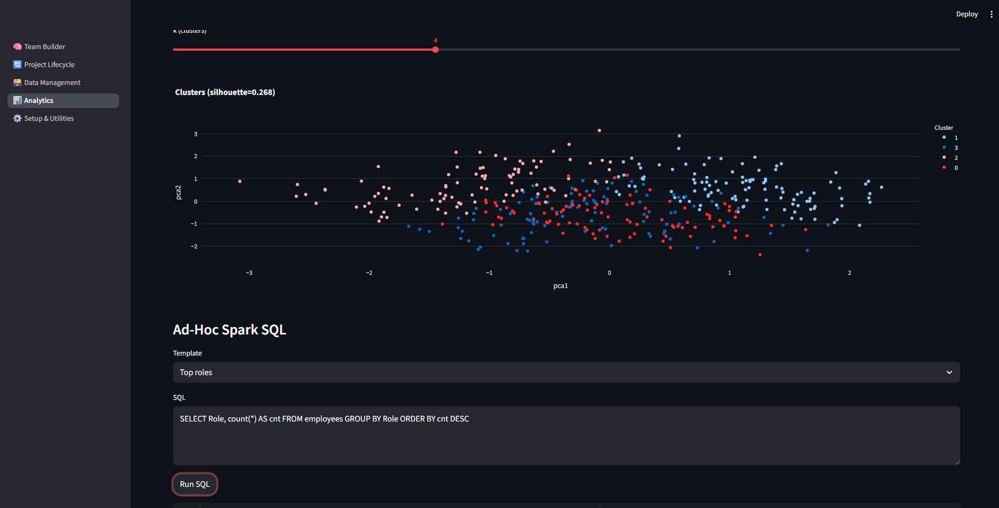
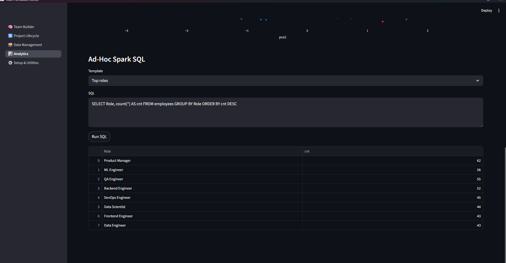

# Project Overview & Philosophy

## Team-Formation-Cortex 

**Team-Formation-Cortex** is an end-to-end, local-first Streamlit application that recommends optimal project teams from a large workforce dataset. It is built on a modern big data stack, showcasing a **Data Lakehouse** architecture as a superior alternative to traditional relational databases for analytical workloads.

The platform leverages Delta Lake for ACID transactions and data versioning, vector search with ChromaDB and sentence-transformer embeddings for semantic understanding, and Google OR-Tools for sophisticated combinatorial optimization.

---

## Project Philosophy: A Modern Approach to DBMS

This project was deliberately designed to impress a university DBMS professor by moving beyond classic, textbook examples (like library or bank management systems) and tackling a real-world analytical problem with an industry-standard, modern data architecture.

It demonstrates a deep understanding of core DBMS principles, but implements them in a more scalable, flexible, and powerful way.

| **Traditional RDBMS (e.g., MySQL Library App)** | **Team-Formation-Cortex (Delta Lakehouse)** |
| :--- | :--- |
| **Focus:** Online Transaction Processing (OLTP). Optimized for fast, small, single-row reads and writes. | **Focus:** Online Analytical Processing (OLAP). Optimized for complex queries that scan and aggregate millions of rows. |
| **Architecture:** A monolithic server that scales **vertically** (buy a bigger, more expensive server). | **Architecture:** A distributed system (Spark) that scales **horizontally** (add more commodity machines/cores). |
| **Schema:** Schema-on-Write. A rigid, pre-defined schema that data must conform to before it can be written. | **Schema:** Schema-on-Read. A flexible schema that can evolve over time. Data is loaded first, and structure is applied during the query. |
| **Key Feature:** ACID transactions on structured data. | **Key Feature:** **ACID transactions on a data lake.** Delta Lake brings the reliability of a traditional database to the massive scale and flexibility of big data files, which is a cutting-edge concept. |

**Why is this a superior DBMS project?** It proves an understanding of how data is managed in the real world today. It shows how to handle data at scale, how to ensure reliability with transactions in a distributed environment, and how to build an intelligent system that provides analytical value, not just simple data storage and retrieval.

---
---

# Page 2: Architecture & Data Flow Deep Dive

## Component Architecture

The application is a self-contained platform built from several powerful open-source components:

1.  **UI & Orchestration (Streamlit):** A multi-page web application that serves as the user interface and the central orchestrator, calling other components to perform tasks.
2.  **Storage & Processing (Apache Spark + Delta Lake):** The core of the data lakehouse. Spark is the distributed processing engine, and Delta Lake is the transactional storage layer that sits on top of standard Parquet files.
3.  **Semantic Retrieval (ChromaDB + Sentence Transformers):** This is the AI's "long-term memory."
    * **Sentence Transformers (`all-MiniLM-L6-v2`):** A lightweight but powerful AI model that converts text (project descriptions) into numerical vector embeddings, capturing their semantic meaning.
    * **ChromaDB:** A specialized vector database that stores these embeddings and allows for incredibly fast similarity searches.
4.  **Optimization (Google OR-Tools):** A CP-SAT solver that finds the optimal solution to the complex combinatorial problem of assembling the best team under multiple competing constraints.
5.  **Reasoning & NLP (LangChain + LLMs):**
    * **LangChain:** A framework for chaining together AI components.
    * **LLMs (Gemini/Ollama):** The language models used to parse natural language requests and generate human-readable justifications.

## Detailed Data Flow

The application's data flow is a classic ETL (Extract, Transform, Load) and analysis pipeline.

```
+------------------+     +----------------------+     +-----------------------+     +---------------------+
| 1. Generate Raw  | --> | 2. Initialize Delta  | --> | 3. Enrich Data        | --> | 4. Build AI Index   |
|    Data (.csv)   |     |    Tables (.delta)   |     |   (Add Avg_Perf)      |     |  (Vector DB)        |
+------------------+     +----------------------+     +-----------------------+     +---------------------+
       |                                                                                   |
       | (User Action)                                                                     | (Ready for Analysis)
       V                                                                                   V
+------------------+     +----------------------+     +-----------------------+     +---------------------+
| 5. User Enters   | --> | 6. AI Parses Request | --> | 7. Similarity Search  | --> | 8. Run Optimizer    |
|   Query in UI    |     |    (LangChain)       |     |   (ChromaDB)          |     |   (OR-Tools)        |
+------------------+     +----------------------+     +-----------------------+     +---------------------+
                                                                                             |
                                                                                             V
                                                                                    +---------------------+
                                                                                    | 9. AI Justifies     |
                                                                                    |    Result (LangChain)|
                                                                                    +---------------------+
                                                                                             |
                                                                                             V
                                                                                    +---------------------+
                                                                                    | 10. Display in UI   |
                                                                                    +---------------------+
```

---
---

# Page 3: Installation & Setup Guide

This guide provides platform-specific instructions for setting up and running the application.

## Manual Installation (Linux)

**Prerequisites:** Python 3.10–3.11, OpenJDK (e.g., 11+).

1.  **Create and activate a virtual environment:**

    ```bash
    python3 -m venv .venv
    source .venv/bin/activate
    ```

2.  **Install all dependencies from `requirements.txt`:**

    ```bash
    pip install --upgrade pip
    pip install -r requirements.txt
    ```

3.  **Run the application:**

    ```bash
    streamlit run app.py
    ```

4.  **First-Time Setup (in the app):**
    * Navigate to the **"Setup & Utilities"** page.
    * Click the buttons in order: **Generate Mock Data** -> **Initialize Delta Tables** -> **Pre-process/Enrich Data** -> **Rebuild Vector DB**.

## Manual Installation (Windows)

**Prerequisites:** Python 3.10–3.11, Java runtime (JDK 17 recommended), and `winutils.exe` configured in your system `Path`.

1.  **Create and activate a virtual environment:**

    ```powershell
    py -3 -m venv .venv
    .venv\\Scripts\\Activate.ps1
    ```

2.  **Install all dependencies from `requirements.txt`:**

    ```bash
    pip install --upgrade pip
    pip install -r requirements.txt
    ```

3.  **Run the application:**

    ```bash
    streamlit run app.py
    ```
4.  **First-Time Setup (in the app):**
    * Follow the same four-step process on the **"Setup & Utilities"** page as described for Linux.

## Manual Installation (macOS)

**Prerequisites:** Python 3.10–3.11, Xcode Command Line Tools.

1.  **Create and activate a virtual environment:**

    ```bash
    python3 -m venv .venv
    source .venv/bin/activate
    ```

2.  **Install all dependencies from `requirements.txt`:**

    ```bash
    pip install --upgrade pip
    pip install -r requirements.txt
    ```

3.  **Run the application:**

    ```bash
    streamlit run app.py
    ```
4.  **First-Time Setup (in the app):**
    * Follow the same four-step process on the **"Setup & Utilities"** page as described for Linux.
    
---
---

# Page 4: User Guide & Feature Showcase

This guide explains how to use each page of the application, with screenshots for clarity.

### Setup & Utilities Page
This is the administrative hub for all data engineering tasks.



### Team Builder Page
This is the main interface for the application where a manager can describe a project and get an AI-powered team recommendation.




### Project Lifecycle Page
This page demonstrates a real transactional workflow where a recommended team is finalized and the project results are saved back to the database.



*Confirmation of a successful ACID save operation:*


### Data Management Page
This page allows direct interaction with the Delta Lake tables, showcasing powerful DBMS features.

* **Time Travel:** Use the slider to view historical versions of your data.



### Analytics Dashboard Page
This page provides a high-level overview of your workforce data.

* **Live Charts & Machine Learning:** View interactive Plotly charts and K-Means clustering results.
* **Ad-Hoc Queries:** Run any Spark SQL query directly against your data lakehouse.





---
---
# Page 5: Advanced DBMS Concepts & Justification

This section is a technical deep-dive intended for a DBMS course evaluation.

---

## Demonstrating ACID Compliance with Delta Lake

A core goal of this project is to prove that modern data lakehouses can provide the same reliability guarantees as traditional RDBMS. This is achieved through **Delta Lake's implementation of ACID transactions.**

### **Atomicity**
All write operations (**MERGE**, **APPEND**, **OVERWRITE**) are atomic.  
When you click **"Complete Project"**, all new project history records are written in a single, atomic transaction.  
If the job fails for any reason (e.g., the machine shuts down), the transaction is aborted, and the database is left in its original, clean state.  
No partial data is ever written. This prevents data corruption.

### **Consistency**
The schemas of the Delta tables are enforced.  
The application includes logic to explicitly cast new data to the target schema before writing (as seen in the **"Project Lifecycle"** page), ensuring that all data written to the lakehouse is consistent and valid, preventing data type mismatches and corruption.

### **Isolation**
Delta Lake uses an **optimistic concurrency control mechanism with snapshot isolation.**  
This means that multiple users or jobs can read from the tables while a write is in progress without seeing a corrupted, intermediate state.  
They will always see the last consistent version (**snapshot**) of the data until the new transaction is successfully committed.

### **Durability**
Once a transaction is successfully committed to the **Delta Log**—a transaction log that serves as the single source of truth—it is permanent and will survive system crashes.  
The log guarantees that the state of the data can always be reconstructed.

---

## Query Optimization in a Data Lakehouse

This project demonstrates two key query optimization techniques that are central to modern analytical databases:

### **1. Columnar Storage (Parquet)**
The underlying data is stored in **Parquet** format.  
When an analytical query is run (e.g., calculating `Avg_Performance` on the dashboard), **Spark** only needs to read the necessary columns (`EmployeeID`, `Individual_Performance_Score`), completely ignoring large text fields like `Project_Description`.  
This dramatically reduces I/O and improves query speed compared to row-based formats like CSV or traditional RDBMS storage.

### **2. Data Partitioning (Predicate Pushdown)**
The Delta tables are physically partitioned on disk by `Domain` or `Domain_Expertise`.  
When a user runs an ad-hoc SQL query with a filter, like:

```sql
WHERE Domain_Expertise = 'Fintech'
